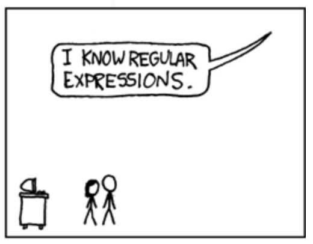

footer: !!Con(**@arkh4m**)
build-lists: true

## Do Parsers Dream of Electric Guitars?!


---

# Hello! 🐒

---

## My name is Ju 🙇🏻‍♂️

---

## I like to play the 🎸

---

## But I'm not very<br>good at it 🙉

---

## So I have to look up<br> songs on the 🕸

---

## But those 🕸 are dark<br>and full of 🙀

---

🎶 🎵 🎶

__[Am]__   Hello darkness, my old __[G]__friend,
I've come to talk with you __[Am]__again,
Because a regex soft__[F]__ly cree__[C]__ping,
Left its seeds while I __[F]__was slee__[C]__ping,
The __[F]__revision that was planted in
__[C]__git blame, still remains__[C]__ __[Am]__
__[C]__Within the __[G]__sound of __[Am]__silence.

---


---

## _Fine_, I'll do it myself

---

🎶 🎵 🎶

__[Am]__   Hello darkness, my old __[G]__friend,
I've come to talk with you __[Am]__again,
Because a regex soft__[F]__ly cree__[C]__ping,
Left its seeds while I __[F]__was slee__[C]__ping,
The __[F]__revision that was planted in
__[C]__git blame, still remains__[C]__ __[Am]__
__[C]__Within the __[G]__sound of __[Am]__silence.

---

## Parsing a blurb of text?

---



[.footer: [xkcd.com/208](https://xkcd.com/208/)]

---

## /**\\[[ABCDEFG]m?\\]**/

---

## This regex finds chords

---

## But it doesn't _really_<br>understands chords

---

## 😥

---

## 😥[^*]

[^*]: disappointed but relieved face

---

## Let's use Elm<br>and [__elm/parser__](https://github.com/elm/parser)

---

## Wishful Programming™[^•]

[^•]: Not actually trademark

___

# A Note

```elm
type Note
    = A
    | C
    | F
    | G
```

---

# A Chord

```elm
type Chord =
    Chord Note
```

---

# A Chord, Pt II

[.code-highlight: 1-4]
[.code-highlight: 1-7]

```elm
type Quality
    = Major
    | Minor
    | Dominant7

type Chord
    = Chord Note Quality
```

---

## But we still need<br>to parse the text!

---

## Let's build a parser

---

[.code-highlight: 1-1]
[.code-highlight: 1-3]

```elm
import Parser exposing (Parser)

chordParser : Parser ???
chordParser =
    ???
```

---

[.code-highlight: 1-3]
[.code-highlight: 1-5]

```elm
import Parser exposing (Parser)

chordParser : Parser Chord
chordParser =
    ???
```

---

## Wishful Programming™

---

[.code-highlight: 1-1]
[.code-highlight: 1-5]
[.code-highlight: 1-6]
[.code-highlight: 1-7]

```elm
import Parser exposing (Parser, (|=), (|.))

chordParser : Parser Chord
chordParser =
    Parser.succeed (\note quality -> Chord note quality)
    |= noteParser
    |= qualityParser
```

---

[.code-highlight: 1-2]
[.code-highlight: 1-3]
[.code-highlight: 1-5]
[.code-highlight: 1-14]

```elm
noteParser : Parser Note
noteParser =
    Parser.oneOf
        [ Parser.succeed A
            |. symbol "A"
        , Parser.succeed F
            |. symbol "F"
        , Parser.succeed G
            |. symbol "G"
        , Parser.succeed C
            |. symbol "C"
        ]
```

---

[.code-highlight: 1-2]
[.code-highlight: 1-3]
[.code-highlight: 1-5]
[.code-highlight: 1-7]
[.code-highlight: 1-9]

```elm
qualityParser : Parser Quality
qualityParser =
    Parser.oneOf
        [ Parser.succeed Minor
            |. symbol "m"
        , Parser.succeed Dominant7
            |. symbol "7"
        , Parser.succeed Major
        ]
```

---

# Tada 🎉

```elm
import Parser exposing (Parser, (|=), (|.))

chordParser : Parser Chord
chordParser =
    Parser.succeed (\note quality -> Chord note quality)
    |= noteParser
    |= qualityParser
```

---

# Tada 🎉

```elm
import Parser exposing (Parser, (|=), (|.))

chordParser : Parser Chord
chordParser =
    Parser.succeed (\note quality -> Chord note quality)
    |. symbol "["
    |= noteParser
    |= qualityParser
    |. symbol "]"
```

---

## Now we really know<br>what the chords are!

---

# What can we do with that

- Figure out which notes compose a chord
- Build a guitar fretboard in Elm
- Choose chords that are nice to play
- Build SVG charts of such chords
- All of this on the fly! Nothing hardcoded!

---

# DEMO 🎸

---

```elm
type Quality
    = Fifth
    | Tertian TertianQuality
    | Sus2 TertianQuality
    | Sus4 TertianQuality
    | Add9 TertianQuality
    | Add11 TertianQuality
    | NewRoot Note TertianQuality

type TertianQuality
    = Major -- Root, Major Third, Perfect Fifth
    | Minor -- Root, Minor Third, Perfect Fifth
    | Augmented -- Root, Major Third, Augmented Fifth
    | Diminished -- Root, Minor Third, Diminished Fifth
    | Dominant7 -- Root, Major Third, Perfect Fifth, Minor Seventh
    | Major7 -- Root, Major Third, Perfect Fifth, Major Seventh
    | Minor7 -- Root, Minor Third, Perfect Fifth, Major Seventh
    | AugmentedDominant7 -- Root, Major Third, Augmented Fifth, Minor Seventh
    | AugmentedMajor7 -- Root, Major Third, Augmented Fifth, Major Seventh
    | Diminished7 -- Root, Minor Third, Diminished Fifth, Diminished Seventh
    | Major6 -- Root, Major Third, Diminished Fifth, Major Sixth
    | Minor6 -- Root, Minor Third, Diminished Fifth, Major Sixth
    | Dominant9 -- Root, Major Third, Perfect Fifth, Minor Seventh, Major Ninth
    | Major9 -- Root, Major Third, Perfect Fifth, Major Seventh, Major Ninth
    | Minor9 -- Root, Minor Third, Perfect Fifth, Minor Seventh, Major Ninth
```

---

# Thanks! 🐒

---

## One more thing...

---

# LIVE DEMO 🤘🏿

---

# Thank you!

__CODE__
github.com/Arkham/elm-chords

__DEMO__
ellie-app.com/5wDzdJyjQ6Ca1

__LIVE DEMO__
ellie-app.com/5wKq8hvfXxBa1
